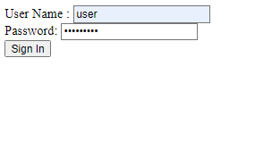

# securing-web

Basic Spring Security in-memory authentication



<!--  -->

- username: user
- password: secret123

Notes
--------

```configure(HttpSecurity http)```

- used for configuration of web-based security at a resource level, based on a selection match. Requests will be allowed to be accessed from the Spring Security Filter Chain.

```configure(WebSecurity web)```

- used for configuration settings that impact global security (ignore resources, set debug mode, by-pass the Spring Security Filter Chain, reject requests by implementing a custom firewall definition).

```configure(AuthenticationManagerBuilder auth)```

- Allows for easily building in memory authentication, LDAP authentication, JDBC based authentication, adding UserDetailsService, and adding AuthenticationProvider's.

[HTTPSecurity vs WebSecurity](https://ravthiru.medium.com/springboot-security-configuration-using-httpsecurity-vs-websecurity-1a7ec6a23273)
[Configure](https://stackoverflow.com/questions/22998731/httpsecurity-websecurity-and-authenticationmanagerbuilder#:~:text=General%20use%20of,passwordEncoder(new%20BCryptPasswordEncoder())%3B%0A%20%20%20%20%20%7D)
[Spring Security](https://boudhayan-dev.medium.com/demystifying-spring-security-setup-e0491acc7df7)

Resource
--------

- [Securing a Web Application](https://spring.io/guides/gs/securing-web/)
- [HTTPSecurity vs WebSecurity](https://ravthiru.medium.com/springboot-security-configuration-using-httpsecurity-vs-websecurity-1a7ec6a23273)
- [Configure](https://stackoverflow.com/questions/22998731/httpsecurity-websecurity-and-authenticationmanagerbuilder#:~:text=General%20use%20of,passwordEncoder(new%20BCryptPasswordEncoder())%3B%0A%20%20%20%20%20%7D)
- [Spring Security](https://boudhayan-dev.medium.com/demystifying-spring-security-setup-e0491acc7df7)
